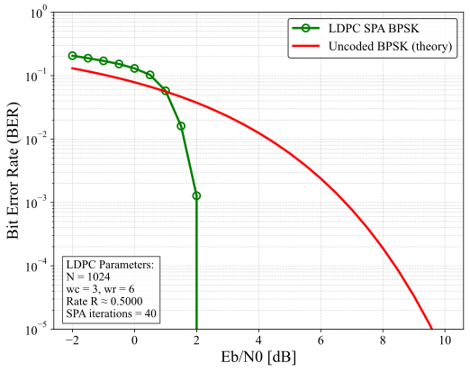

# fec-ldpc-codec


C implementation of **Low-Density Parity-Check (LDPC) codes** with:

- **Gallager-type LDPC matrix construction**
- **Systematic LDPC encoding (GF(2))**
- **Sum-Product Algorithm (SPA) decoding (LLR-domain)**
- **BPSK modulation + AWGN channel**
- **Eb/N0 BER simulation**
- **Python plotting scripts with automatic parameter detection**

Designed for **FEC research**, **communication systems**, and **educational use**.

---

## 📘 Overview

This repository provides a fully modular and research-friendly LDPC codec:

- Generate LDPC matrices *(Gallager regular (N, wc, wr) codes)*
- Construct systematic generator matrix **G** from parity-check **H**
- Encode LDPC codewords: `c = u × G  (GF(2))`
- Decode via **SPA (LLR-domain Sum-Product Algorithm)**
- Add AWGN channel noise
- Measure BER vs Eb/N0
- Auto-select LDPC matrices at runtime
- Auto-load BER CSV files for plotting

⚠ **Note**

This implementation does **not** replicate standardized LDPC codes
(5G NR Base Graphs, DVB-S2, Wi-Fi 802.11n/ac, etc.).
H/G matrices are **Gallager-type random regular LDPC codes**,
intended for research, education, and experiments.

---

## 📁 Project Structure

```
fec-ldpc-codec
├── src/                 # Encoder/decoder core
├── include/             # Public headers
├── matrices/            # LDPC (H,G) matrices (CSV)
├── mains/               # BER simulation & matrix generator
├── results/             # BER CSV files (auto-named)
├── images/              # BER plots (PNG/SVG)
├── python/              # Plotting scripts
├── .github/workflows/   # CI (GCC build)
├── Makefile             # Build
└── README.md
```

---

## 📑 Features

### ✔ LDPC Matrix Handling (H/G)
- Loads matrices from:
  ```
  matrices/N{N}_wc{wc}_wr{wr}/H.csv
  matrices/N{N}_wc{wc}_wr{wr}/G.csv
  ```
- Interactive folder selection
- CSV-based, human-editable

### ✔ LDPC Encoder (Systematic)
Fast XOR-based GF(2) linear encoding:

```
code[i] = Σ_j  (inf[j] & G[j][i])  mod 2
```

### ✔ SPA LDPC Decoder
LLR-domain Sum-Product Algorithm:

- Check-node update (log-domain SPF)
- Variable-node update
- Parity-check verification
- Early stopping enabled
- Clear, research-friendly implementation

---

## ✔ Gallager LDPC Matrix Generator
Provided in `mains/gene_hg.c`:

- Regular LDPC construction (wc, wr)
- Gaussian elimination for systematic **G**
- 4-cycle counting
- Searches for minimum-4-cycle H/G pair
- Outputs:
  - `H.csv`
  - `G.csv`
  - `info.txt`

---

## ✔ AWGN BER Simulation

- BPSK mapping
  ```
  0 → -1
  1 → +1
  ```
- Gaussian noise from Box–Muller
- LLR formula:
  ```
  LLR = 2y / σ²
  ```
- SPA decoding (configurable max_iter)
- Output filename automatically includes parameters:

```
results/ldpc_ber_N{N}_wc{wc}_wr{wr}_iter{iter}_data.csv
```

Example:

```
results/ldpc_ber_N1024_wc3_wr6_iter40_data.csv
```

---

## 🛠 Build Instructions

### Requirements
- GCC or Clang
- `make`
- Linux / macOS / WSL / MinGW

### Build

```sh
make
```

Produces:

```
ldpc_ber      # BER simulator
gene_hg       # LDPC matrix generator
```

Clean:

```sh
make clean
```

---

## 🚀 Usage Example

### 1. BER Simulation

```sh
./ldpc_ber
```

Folder selection example:

```
Available LDPC matrix folders:
  [0] matrices/N1024_wc3_wr6
  [1] matrices/N2048_wc4_wr8
Select folder index:
```

Outputs a parameter-tagged CSV:

```
results/ldpc_ber_N1024_wc3_wr6_iter40_data.csv
```

---

## 📉 BER Performance

Example (N=1024, wc=3, wr=6, SPA=40):



Generated via:

```sh
python python/plot_ldpc_ber.py
```

Plot script automatically annotates:

- N
- wc, wr
- Rate R
- SPA iterations

---

## 📂 Source Code Structure

### src/
| File | Description |
|------|-------------|
| `ldpc_encoder.c` | Systematic encoder |
| `ldpc_decoder.c` | SPA decoder |
| `ldpc_matrix.c`  | H/G handling utilities |

### include/
| File | Description |
|------|-------------|
| `ldpc_encoder.h` | Encoder API |
| `ldpc_decoder.h` | SPA API |
| `ldpc_matrix.h`  | Matrix API |

### mains/
| File | Description |
|------|-------------|
| `ldpc_ber.c` | BER simulation |
| `gene_hg.c`  | LDPC matrix generator |

### python/
| File | Description |
|------|-------------|
| `plot_ldpc_ber.py` | BER plotting (PNG/SVG) |

---

## 🔒 Confidentiality Notice

All source code in this repository was developed **independently**,
based only on **public standards and academic knowledge**.

No confidential, proprietary, or NDA-restricted information is used.

---

## 📜 License

MIT License — free for research, education, and commercial use.

---

## 🤝 Contributing

Pull requests welcome!
For significant changes, please open an issue first.

---

## ⭐ Acknowledgements

Developed as part of research in **Forward Error Correction (FEC)**
and **physical-layer wireless communications**.

If this repository helps you, please consider giving it a ⭐!
